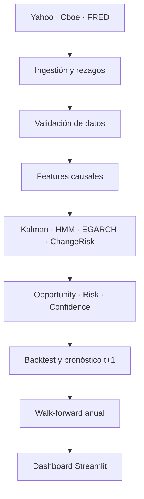

# S&P 500 Decision Lab — MVP 3

Aplicación web educativa para estudiar el estado del S&P 500 con datos históricos EOD, modelos matemáticos transparentes y validación fuera de muestra. El sistema combina **Filtro de Kalman, HMM, EGARCH y detección causal de cambios** para producir tres medidas separadas:

- **Opportunity Score**: condiciones históricas favorables, 0–100.
- **Risk Score**: presión de riesgo observada, 0–100.
- **Confidence Score**: confiabilidad interna de la lectura, 0–100.

La aplicación nunca genera una orden de compra o venta. Sus estados son descriptivos: *Esperar*, *Entrada muy parcial*, *Entrada gradual favorable* y *Condición históricamente muy favorable*.

La vista principal añade un **pronóstico experimental para la próxima sesión**. Informa probabilidad positiva, retorno esperado, intervalo del 80% y volatilidad EGARCH `t+1`; también declara cuando la validación no demuestra ventaja frente a referencias simples.

> Uso educativo y de investigación. No constituye asesoría financiera. El rendimiento pasado no garantiza resultados futuros.

## Estado del MVP

Referencia validada localmente el **9 de septiembre de 2026** (`experiment_id: 0c75c69c484b`). El repositorio público no redistribuye los snapshots de mercado: los descarga de sus fuentes originales y los reconstruye en el primer arranque.

| Validación out-of-sample 2020–2026 YTD | DecisionLab | Buy & Hold SPY |
|---|---:|---:|
| CAGR | 4.45% | 15.40% |
| Volatilidad anualizada | 6.29% | 20.10% |
| Sharpe | 0.72 | 0.81 |
| Sortino | 0.97 | 1.15 |
| Maximum Drawdown | -10.98% | -33.72% |

La primera baseline ofrece una reducción material del drawdown y de la volatilidad, pero todavía no supera simultáneamente a Buy & Hold en Sharpe, Sortino o CAGR. Este resultado mixto se conserva deliberadamente: los años de prueba no se utilizaron para ajustar pesos o umbrales.

## Qué incluye

- Descarga automática de SPY y SPX, VIX oficial de Cboe y ocho series FRED.
- Almacenamiento CSV por defecto; Parquet y DuckDB disponibles con las dependencias opcionales.
- Validación de duplicados, cobertura, coherencia OHLC, valores no positivos, outliers y freshness.
- 15–25 variables iniciales de precio, tendencia, momentum, volatilidad, VIX, drawdown y macro.
- Kalman lineal de nivel/tendencia, con innovación, NIS e incertidumbre.
- HMM gaussiano de cuatro estados con las probabilidades completas filtradas.
- EGARCH(1,1) estimado por máxima verosimilitud.
- ChangeRisk causal y segmentación binaria offline para diagnóstico.
- Decision Engine explicable, backtesting, costos configurables y walk-forward anual.
- Pronóstico probabilístico a una sesión con modelo direccional regularizado, retorno esperado e intervalo EGARCH.
- Dashboard Streamlit oscuro con cinco vistas, ventanas temporales, velas opcionales y análisis de ablación.
- Pruebas automatizadas de cálculos y ausencia de look-ahead.

## Arquitectura



Cada señal calculada al cierre de `t` se aplica al retorno de `t+1`. HMM y EGARCH se vuelven a estimar al inicio de cada año de prueba usando únicamente observaciones anteriores.

## Instalación local

Requiere Python 3.11 o 3.12.

### Windows PowerShell

```powershell
py -3.12 -m venv .venv
.venv\Scripts\Activate.ps1
python -m pip install -r requirements.txt
python scripts\build_snapshot.py --refresh
streamlit run streamlit_app.py
```

### macOS o Linux

```bash
python3 -m venv .venv
source .venv/bin/activate
python -m pip install -r requirements.txt
python scripts/build_snapshot.py --refresh
streamlit run streamlit_app.py
```

Para habilitar también Parquet, DuckDB y librerías de comparación:

```bash
python -m pip install -r requirements-optional.txt
```

Streamlit mostrará normalmente `http://localhost:8501`.

## Uso rápido

Consulta también el [manual simple de usuario](docs/MANUAL_USUARIO.md).

1. Abre **Estado actual** para ver los tres scores, régimen y explicación.
2. Lee el bloque **Pronóstico experimental** junto con su estado de validación fuera de muestra.
3. Elige `Línea` o `Velas`; controla el período desde `Ventana visual` en la barra lateral.
4. Cambia la ventana entre `1M` y `10Y` en la barra lateral.
5. Usa **Backtesting** para comparar con Buy & Hold y simular costos.
6. En **Modelos**, desactiva componentes y observa el análisis de ablación.
7. Revisa **Datos y calidad** antes de interpretar resultados.
8. Pulsa **Actualizar fuentes** para descargar EOD y volver a estimar todos los folds.

## Fuentes de datos

| Variable | Fuente | Frecuencia | Regla de disponibilidad |
|---|---|---|---|
| SPY / SPX | Yahoo Finance Chart API | Diaria EOD | Cierre de la sesión |
| VIX | Cboe Global Markets | Diaria EOD | Cierre de la sesión |
| Fed Funds (`DFF`) | FRED | Diaria | +1 día hábil |
| Treasury 2Y / 10Y (`DGS2`, `DGS10`) | FRED | Diaria | +1 día hábil |
| CPI (`CPIAUCSL`) | FRED | Mensual | +35 días hábiles conservadores |
| Desempleo (`UNRATE`) | FRED | Mensual | +7 días hábiles |
| Dólar amplio (`DTWEXBGS`) | FRED | Diaria | +1 día hábil |
| WTI (`DCOILWTICO`) | FRED | Diaria | +1 día hábil |
| High-yield spread (`BAMLH0A0HYM2`) | FRED | Diaria | +1 día hábil |

No se requiere API key. El proveedor de mercado incluye dos hosts Yahoo como contingencia; VIX usa Cboe y cae a Yahoo únicamente si Cboe no responde.

## Actualizar y reproducir

```bash
# Solo descarga y valida mercado/macro
python -m data.ingestion.pipeline --refresh

# Reconstruye features, modelos, walk-forward y snapshots
python scripts/build_snapshot.py --refresh

# Ejecuta las pruebas
python -m pytest --cov --cov-report=term-missing
```

Cada corrida registra configuración, huella SHA-256 de los datos, versión, fecha, métricas y `experiment_id` en `data/processed/experiments/`.

## Publicar gratis en Streamlit Community Cloud

1. Crea un repositorio en GitHub y sube el código fuente, sin los datos ignorados por `.gitignore`.
2. En Streamlit Community Cloud elige **Create app**.
3. Selecciona el repositorio, la rama y `streamlit_app.py` como archivo principal.
4. No agregues secretos: el MVP usa fuentes públicas sin API key.
5. En el primer arranque, la aplicación descarga los históricos y construye el snapshot en el almacenamiento efímero de Streamlit; puede tardar aproximadamente 1–2 minutos.

La actualización EOD puede ejecutarse manualmente desde el dashboard. Para una actualización programada, agrega un workflow de GitHub Actions con la política de redistribución de datos revisada.

## Estructura principal

```text
app/               Interfaz, páginas, componentes y gráficos
backtesting/       Motor, métricas y walk-forward
config/            Parámetros centralizados
core/              Orquestación, rutas, logging y persistencia
data/              Proveedores, ingestión, validación y features
decision/          Opportunity, Risk, Confidence y explicación
forecasting/       Pronóstico t+1, intervalos y validación temporal
models/            Kalman, HMM, EGARCH y Change Point
database/          DuckDB y copias Parquet locales (no versionados)
docs/              Arquitectura, metodología, diccionario y validación
scripts/           Construcción reproducible del snapshot
tests/             Pruebas unitarias e integración
```

## Controles contra look-ahead

- Indicadores rolling calculados únicamente con ventanas terminadas en `t`.
- Rezagos explícitos de publicación para macroeconomía.
- Probabilidades HMM **filtradas**, no suavizadas con observaciones futuras.
- EGARCH de prueba ajustado exclusivamente con el train anterior.
- Pronóstico `t+1` entrenado por año; el retorno siguiente se reserva como resultado y no como variable.
- Señal del cierre `t` desplazada antes de multiplicarla por el retorno `t+1`.
- Score walk-forward de cada fold usa solo folds ya finalizados.
- Pruebas que alteran el futuro y verifican que el pasado no cambie.

## Limitaciones conocidas

- FRED estándar puede reflejar revisiones históricas. Los rezagos aproximan disponibilidad, pero `macro_vintage_safe=false` hasta integrar ALFRED.
- La serie de spread high-yield disponible por el CSV público tiene cobertura parcial en el snapshot; el HMM la omite automáticamente cuando un train no alcanza 200 observaciones.
- Los horizontes largos tienen pocas observaciones efectivamente independientes debido al solapamiento.
- El HMM puede cambiar la interpretación interna de estados entre folds; un mapeo determinista los vuelve a nombrar por retorno y volatilidad del train.
- La baseline reduce riesgo, pero aún no demuestra superioridad global ajustada por riesgo.
- El pronóstico diario actual no supera sus referencias simples en la validación 2020–2026 YTD; debe leerse como experimental.
- No se ha implementado UKF ni TFT: solo se añadirán contra una baseline estable y bajo comparación out-of-sample.

Consulta el [Manual de usuario](docs/MANUAL_USUARIO.md), [Arquitectura](docs/ARCHITECTURE.md), [Metodología](docs/METHODOLOGY.md), [Diccionario de datos](docs/DATA_DICTIONARY.md), [Validación](docs/VALIDATION.md), [Roadmap](docs/ROADMAP.md) y [consideraciones de licencia](docs/DATA_LICENSE.md).
